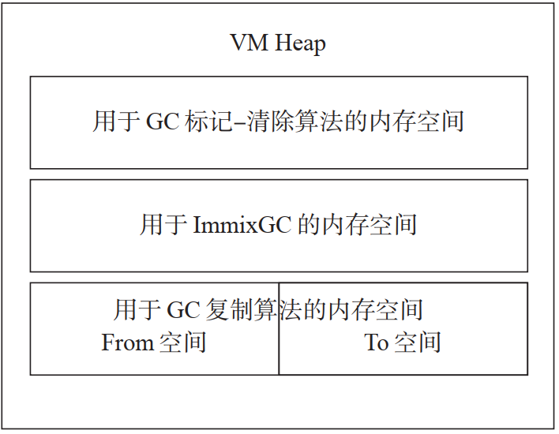
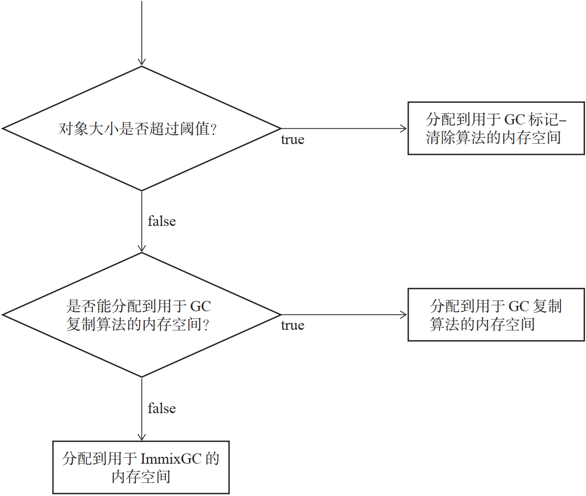
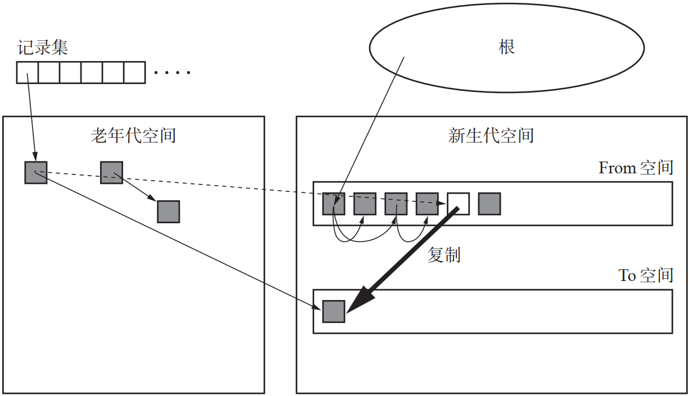
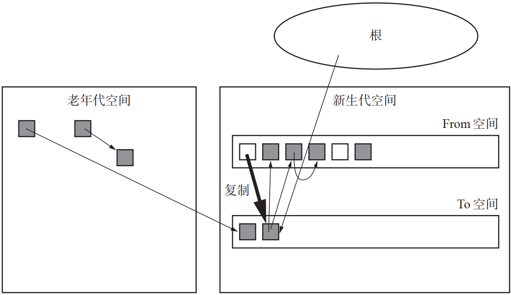
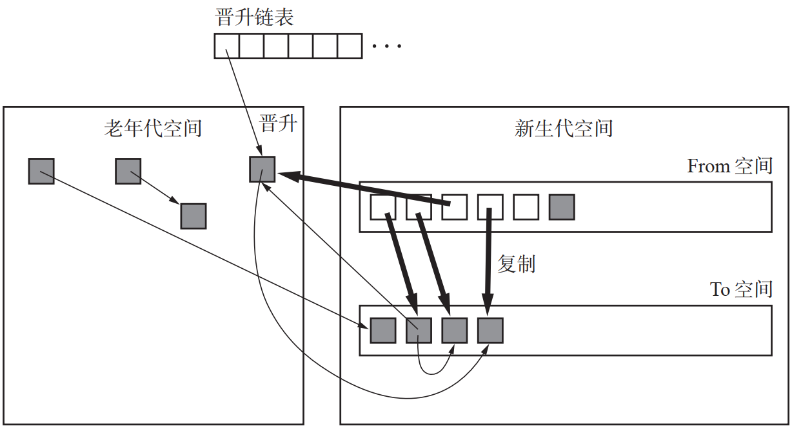
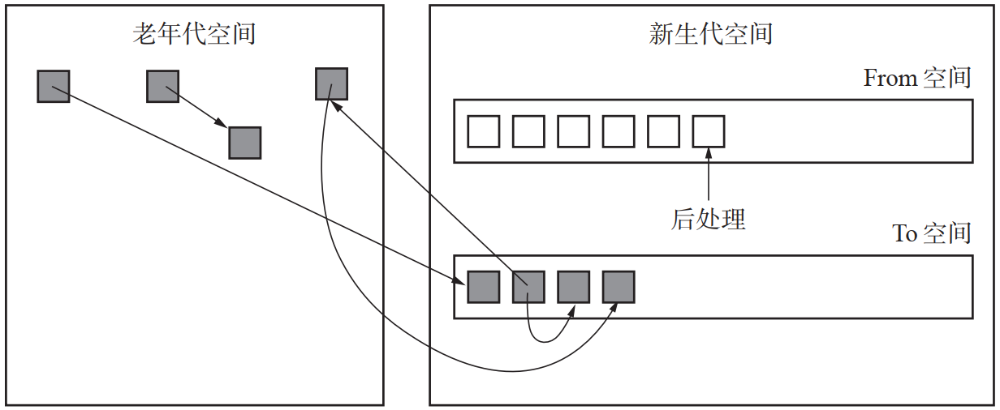
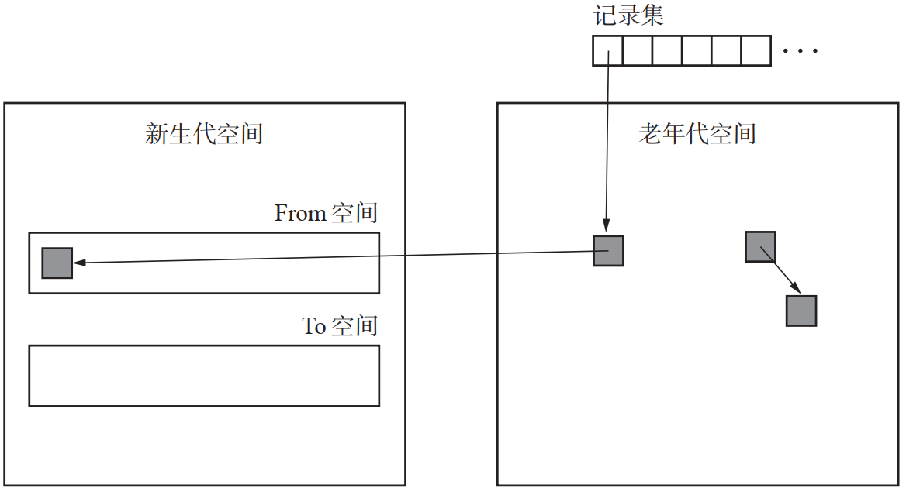
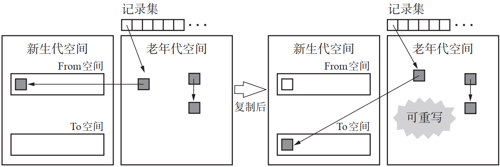
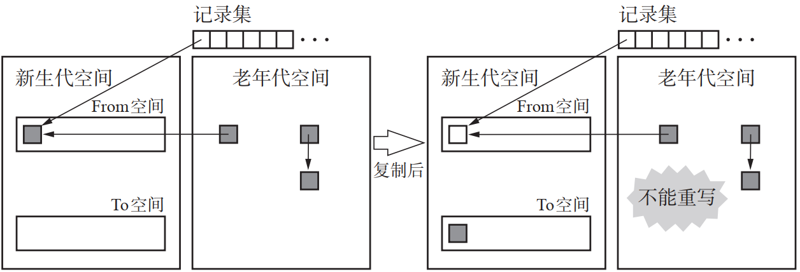

# Rubinius垃圾回收
## 用于GC复制算法的内存空间

## 对象的分配器

| GC名 | 类名 |
| --- | --- |
| GC复制算法 | BakerGC |
| ImmixGC | ImmixGC |
| GC标记-清除算法 | MarkSweepGC |

## GC分代算法
|  | 名称 |
| --- | --- |
| 新生代GC | GC复制算法(Cheney的GC复制算法) |
| 老年代GC | GC标记-清除、ImmixGC(GC标记-压缩算法) |

## GC复制算法
### 搜索从记录集引用的对象

- 首先搜索从记录集引用的对象，将其子对象复制到To空间
- 复制完一个子对象，父对象内的原始地址就会被重写称目标空间的地址
- Rubinius的GC是分代垃圾回收，因此必然需要通过记录集等手段记录新生代GC和老年代GC之间的引用

### 复制从根引用的对象

- 接下来把从根内部引用的对象复制到To空间，把根内的指针重写到目标空间，再把forwarding指针设定给原始空间

### 复制子对象

- 把从根引用的所有对象全复制到To空间后，接下来就要搜索To空间内的对象，并把其子对象反复复制到To空间
- 当对象从From空间复制到To空间时，要检查对象的年龄。如果年龄满足成为老年代的条件，这个对象就会被晋升，并被记录到晋升链里
- 这个晋升链表负责记录那些指向GC过程中晋升的对象的指针。另外，记录在晋升链表里的对象的子对象也会被复制到To空间

### 后处理

- 如果所有需要搜索的对象都搜索完了，就该对残留在From空间里的垃圾对象执行后处理

## 疑问
### 该在何时启动各个GC算法?
- 当用于GC复制算法的内存空间满了，无法分配对象时，就该启动GC复制算法
- 这是因为一般执行分配时用的是新生代GC的GC复制算法的分配器，它根老年代GC的GC标记-清除算法以及ImmixGC不同，不会频繁启动GC复制算法
- ImmixGC和GC标记-清除算法的启动时机是相同的，那就是用于GC标记-清除算法的内存空间中被分配了一定程度的内存量

###  为什么是准确式GC?
#### 保守式GC和准确式GC
|  种类| 优点 | 缺点 |
| --- | --- | --- |
| 保守式GC | mutator不用在意GC | 能使用的GC算法有限 |
| 准确式GC | GC算法没有限制 | mutator需要意识到GC |
#### 保守式GC
- 保守式GC在mutator内(几乎)不用在意GC的存在，所以能非常轻松地生成处理程序，这样一来在CRuby中就能简单地描述C语言扩展库
- 但是另一方面，保守式GC有着诸多限制，例如不能实现单纯的GC复制算法等，因此保守式GC位于一个很难改良GC本身的环境里

#### 准确式GC
- 准确式GC则需要在mutator内考虑GC
- 但因为准确式GC在GC算法上没有限制，所以可以较为简单改良GC，也可以简单实现GC复制算法

### 为什么要把老年代对象存储在记录集里？
- 回忆一下Rubinius写入屏障。当从老年代空间内的对象引用新生代空间内的对象时，指向老年代对象的指针被存入记录集中
- 
- 是不是觉得很奇怪？这样一来，就没法马上看出老年代对象内的那个成员变量持有指向新生代引用。单纯来想的话，把新生代对象存储在记录集里似乎更合适一些
- 原因
  - (1) 当记录老年代对象
    - 
  - (2) 当记录新生代对象时
    - 
- Rubinius的新生代GC是GC复制算法
  - 在记录集记录了新生代对象的情况下，虽说可以把新生代对象复制到To空间
  - 但这样就没办法把目标空间的地址传达给老年代对象了
  - 因此不可能从引用的目标去查找引用的起点
  - 当新生代GC的算法不是像GC复制算法这样移动对象算法时，往记录里记录新生代对象会更节省搜索时间，更有效率
- 如果记录集是老年代对象
  - 可以用目标空间的地址重写成员变量的内容
  - 这时因为记录集已知老年代对象的地址
  - 不过，当记录集记录了老年代对象时，在执行GC时就必须搜索一次全体对象
  - 因为对象的子对象中也可能掺杂着老年代对象，所以需要为此付出相应的时间和精力