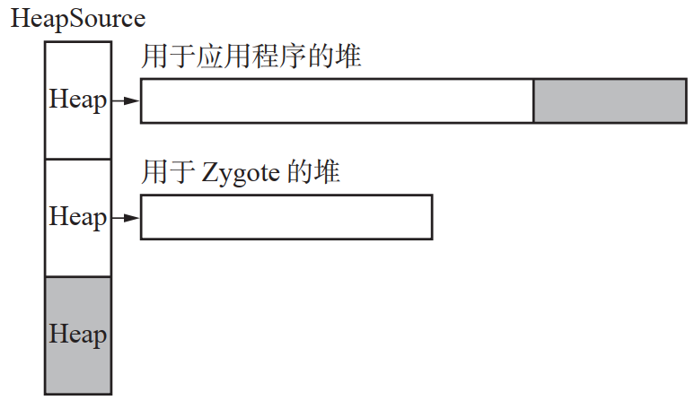
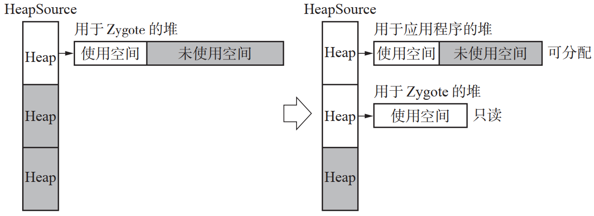
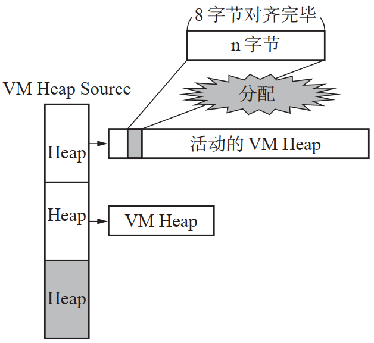
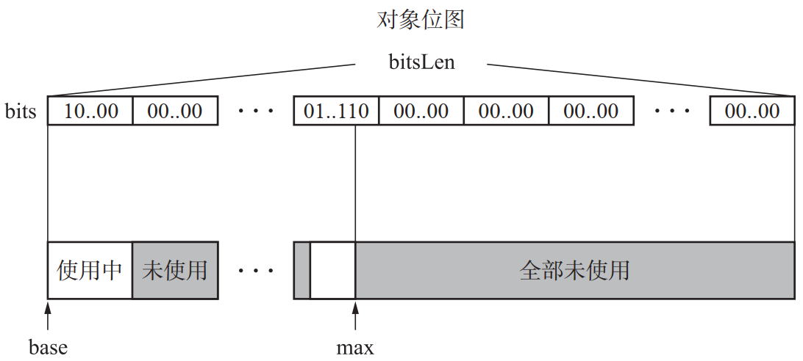

# DalvikVM垃圾回收
## DalvikVM 的内存结构
### VM HeapSource 与 VM Heap 
- 
- VM HeapSource 基本上保留着两种 VM Heap
  - 第 一 种 是 用 于 Zygote（所 有 Android 应 用 程 序 的 父 进 程）的 VM Heap
    - Zygote 会 在Android 启动时开始运行，执行一些预处理操作，例如动态读取要被连接的库群等
  - 第二种是分别在每个 Android 应用程序中使用的 VM Heap
    - 当 Android 应用程序（例如电话本等）需要内存的时候，程序就从这个 VM Heap 进行分配

### 追加VM Heap
- 

### 从VM Heap分配内存
- 
  
## 对象位图
###  标记位图
- 标记位图是在GC标记时使用的位图
### 对象位图
- 对象位图则用于获取分配到的VM Heap内的对象的位置
- 每次往VM Heap内分配对象时，都会执行位图标记操作
- 对象位图存在每个VM Heap内
- 

## 疑问
### 为什么要准备两个位图?
- DalvikVM 中准备了两个位图
  - 对象位图
  - 标记位图
- 然而有必要准备两个位图吗？只准备一个标记位图，之后DalvikVM的VM Heap内进行搜索不就好了吗？
- 在清除阶段
  - 准备了两个位图的情况下，清除时用XOR求出对象位图和标记位图的差分
  - 之后只要基于这个结果释放"非活动对象"就可以了
  - 可是如果只准备了标记位图的话，搜索"非活动对象"就没那么容易了
  - 如果要在对象已经被分配了的情况下找出非活动对象，就必须搜索整个VM Heap
  - 这样一来，缓存就脏了，从速度上来说也很不利

### 为什么要采用位图标记？
- Android 的应用程序都是从 Zygote fork() 的进程。在启动 Android 时，Zygote 会把执行应用程序所必需的数据分配到用于 Zygote 的 VM Heap 中
- Android 的应用程序都是从 Zygote fork() 的进程。在启动 Android 时，Zygote 会把执行应用程序所必需的数据分配到用于 Zygote 的 VM Heap 中
- 但是在没有使用位图的标记阶段中，为了进行标记，对象会被直接写入，这时就会发生写时复制，这样一来放置在共享空间的内存空间就会被复制到进程的私有空间里
- 为了防止这一点，我们只从对象那里拿走标记位，将其用位图的形式来表示