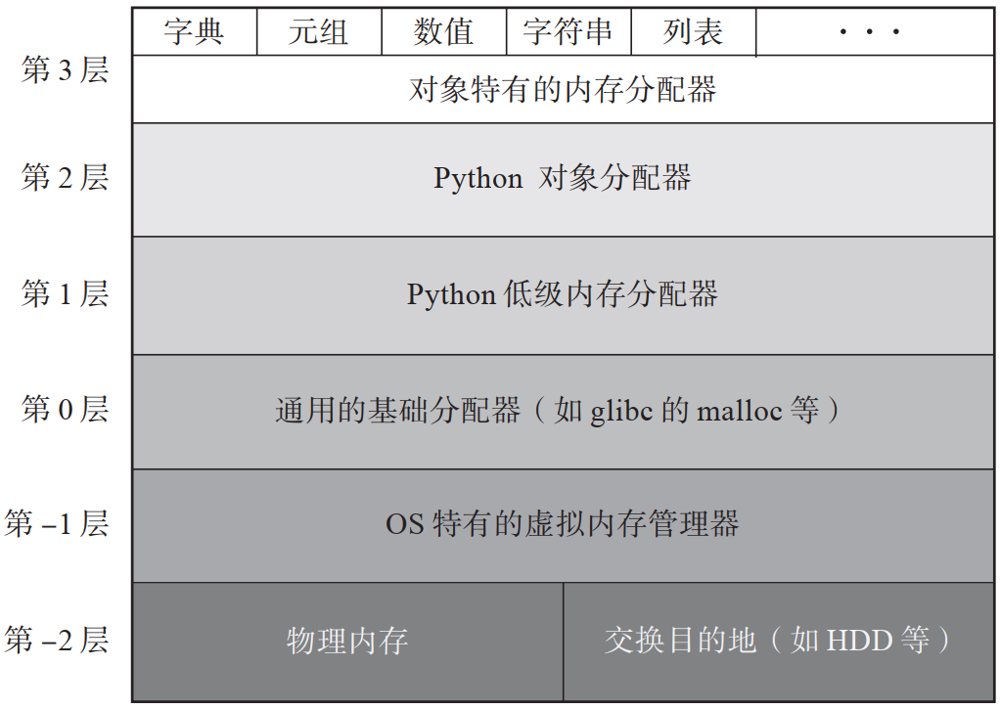
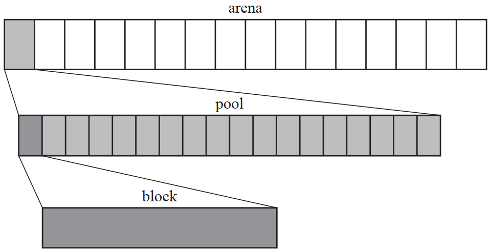
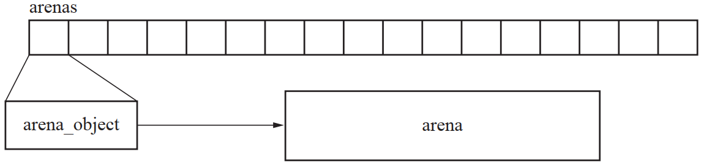
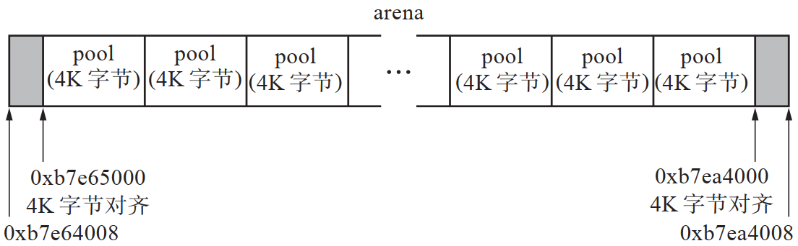
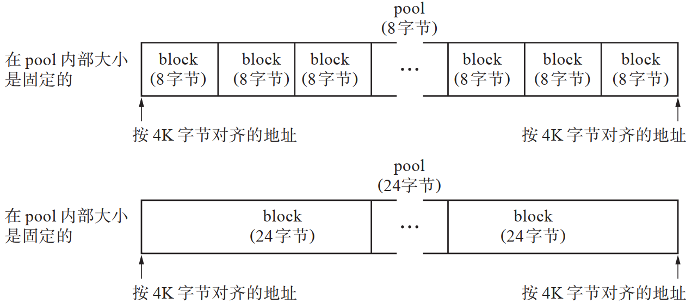
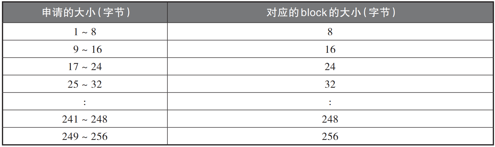
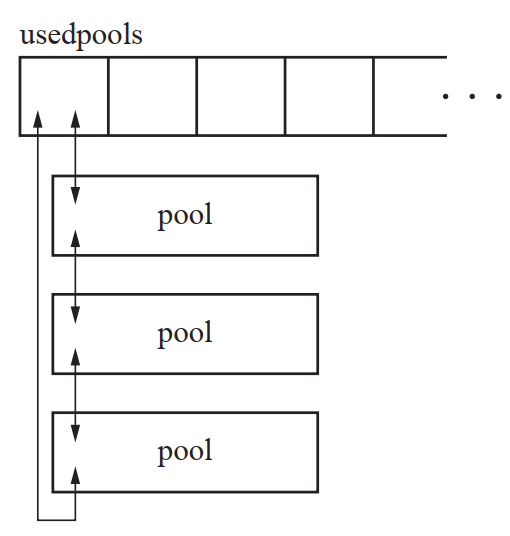
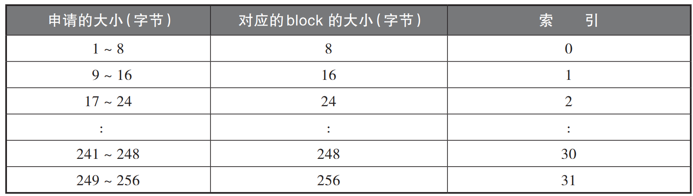
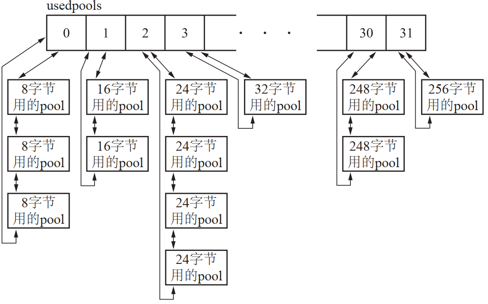
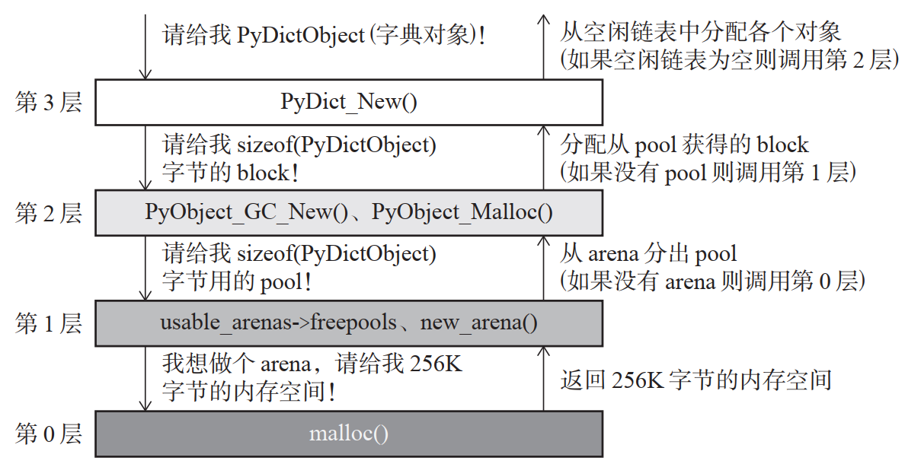

## Python垃圾回收

### Python内存结构
- 

### 第1层 Python低级内存分配器
#### 前提说明
- 
- 根据所管理的内存空间的作用和大小的不同，它们各自的叫法也不相同
- 根据所管理的内存空间的作用和大小的不同，它们各自的叫法也不相同
- 比 block 大的单位的是 pool，pool 内部包含 block。pool 再往上叫作 arena
- arena > pool > block

#### arena
- arena 这个词有“竞技场”的意思。大家可以理解成竞技场里有很多个 pool，pool 里面漂浮着很多个 block
- arena_object 结构体管理着 arena
    ```
    struct arena_object {
        /* malloc 后的 arena 的地址
        uptr address;

        /* 将 arena 的地址用于给 pool 使用而对齐的地址 */
        block* pool_address;

        /* 此 arena 中空闲的 pool 数量 */
        uint nfreepools;

        /* 此 arena 中 pool 的总数 */
        uint ntotalpools;

        /* 连接空闲 pool 的单向链表 */
        struct pool_header* freepools;

        /* 稍后说明 */
        struct arena_object* nextarena;
        struct arena_object* prevarena;
    };
    ```
- arena_object 还承担着保持被分配的 pool 的数量、将空 pool 连接到单向链表的义务
- 此外， arena_object 还被数组 arenas 管理
- 

#### pool
- 
- arena 内部各个 pool 的大小固定在 4K 字节
- 因为几乎对所有 OS 而言，其虚拟内存的页面大小都是 4K 字节，所以我们也相应地把 pool 的大小设定为 4K 字节

### 第2层 Python对象分配器
#### block
- 
- pool 被分割成一个个的 block,这是因为我们一开始利用
pool 的时候就决定了“这是供 8 字节的 block 使用的 pool”
- 每个 block 的大小定为 8 的倍数，相应地 block 的地址肯定也是 8 的倍数，这理所当然，因为 pool 是按 4K 字节（2 的 12 次方）对齐的
- 

#### usedpools
- usedpools 是保持 pool 的数组
  - 以 block 为单位划分 pool 的，也就是说，pool 内所有
block 的大小都相等
  - 因此，要想找到与所申请的大小相对应的 block，首先必须找到有这个
block 的 pool
  - 搜索这个 pool 的过程必须是高速的
  - 因为在每次分配时都会进行这项搜索处理，所以如果这里的性能不佳的话，就会大幅影响应用程序的整体性能
- 
  - 每个 pool 用双向链表相连，形成了一个双向循环链表
  - usedpools 里存储的是指向开头10.6　第 2层  Python对象分配器 pool 的指针
- usedpools 负责从众多 pool 中找出那些 block 的大小符合要求的 pool，并将其高速返回
  - 
  - 

### 第3层 对象特有的分配器
- 对象有列表和元组等多种多样的型，在生成它们的时候要使用各自特有的分配器
- 
