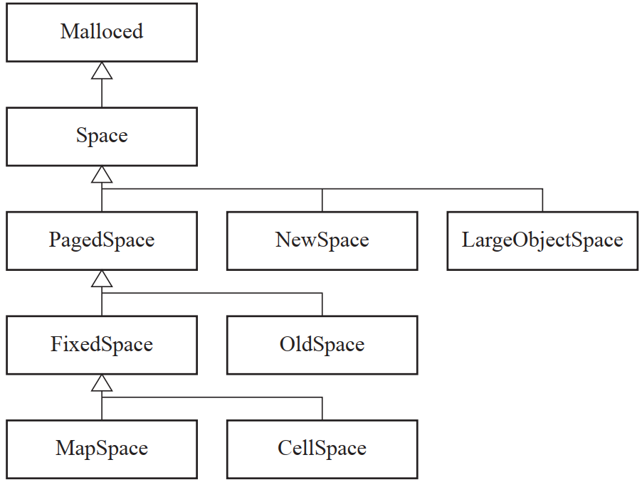
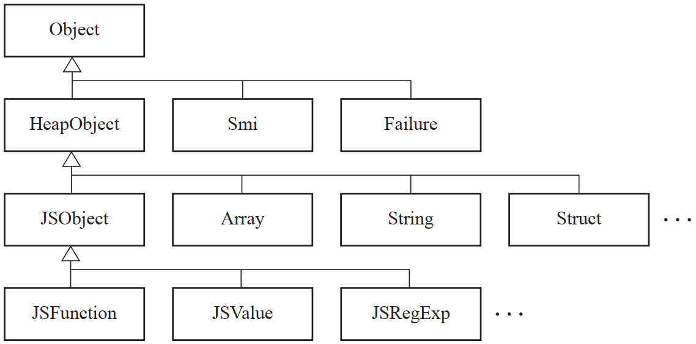
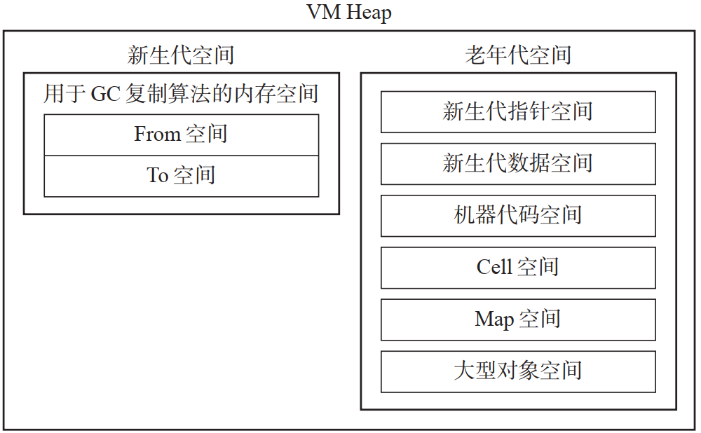
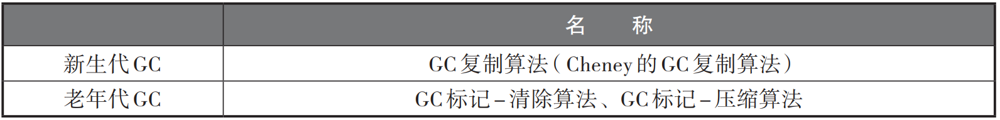

# V8垃圾回收
## 对象管理
### Malloced类
- Malloced类使用malloc()生成实例。反过来销毁实例时则使用free()
#### 内存空间的继承关系

- Space: 抽象类，为各个内存空间类的父类
- PagedSpace: 拥有8K字节的多个页面
- NewSpace: 拥有大小相同的两个内存空间(From空间和To空间)
- LargeObjectSpace: 当mutator发出申请时，直接从OS获取内存
- FixedSpace: 只分配固定大小的对象
- OldSpace: 分配可边大小的对象
- MapSpace: 用于Map空间
- CellSpace: 用于Cell空间
### Object类

## VM Heap
### 组成
- 新生代空间
- 老年代空间

### 老年代内的内存空间

| 内存空间名 | 分配到空间内的对象的种类 |
| --- | --- |
| 老年代指针空间 | 可能引用新生代空间的对象 |
| 老年代数据空间 | 不具备指针的字符串等数据对象 |
| 机器代码空间 | 用JIT生成的机器代码 |
| Map空间 | 对象的型信息 |
| Cell空间 | 内置类、方法等(JavaScript中的Array类等) |
| 大型对象空间 |大于等于8K字节的大对象(从OS直接分配)  |

### VM Heap结构

## 准确式GC
### HandleScope
### 打标签
### 控制对象内的域

## GC算法

### 启动GC的时机
#### 启动新生代GC(GC复制算法)的时机
- 新生代空间From空间没有分块的时候
#### 老年代GC(GC标记-清除算法及GC标记-压缩算法)启动时机
- 老年代空间的某一个空间没有分块的时候
- 老年代空间中被分配了一定数量的对象的时候(启动新生代GC时检查)
- 老年代空间里没有新生代空间大小的分块的时候(不能保证执行新生代GC时晋升)
#### 在老年代GC的启动过程中，启动GC标记-压缩算法的时机如下
- 老年代空间的碎片到达一定数量的时候